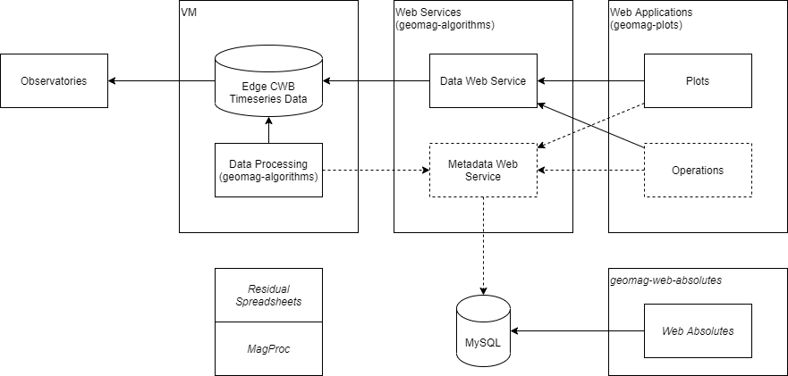

# Overview

## Background

Geomag observatories produce raw time series data based on measurements of Earth’s magnetic field. These raw time series are adjusted in near-real time to eliminate spikes and apply baseline corrections, and later adjusted again to produce definitive data. Additionally, other algorithms combine time series to produce derived time series.

## Architecture

Observatories use a new ObsRIO system which records vector magnetometer data at 10Hz, generates MiniSEED formatted output, and supports SEEDLink for data transfer. Data are reported using double precision floating point, which mirrors the ObsRIO internal processing format, and MiniSEED blocks are generated every few seconds to decrease latency.

Observatory data is acquired and stored using Edge Continuous Waveform Buffer (CWB) software. Edge CWB acquires MiniSEED data using SEEDLink and other protocols and provides TCP query services for data access. This software and format is widely used by the Seismic community for high volume timeseries data and supported by another team.

The Geomag Algorithms python library (this project) includes algorithms for data processing as well as web services for data access. Geomag Algorithms uses ObsPy for timeseries data, and FastAPI for web services.

The Geomag Plots project includes web applications that access web services to visualize and eventually manage data and metadata.

Web Absolutes is a legacy application used to enter regular calibration measurements recorded at observatories. This supports the "null" method, but does not support the "residual" method used at high latitudes; which use spreadsheet macros.

MagProc definitive data processing software was developed to process one-minute data. It provides tools for reviewers to identify and remove spikes from data, and requires manual effort to prepare and process data. A separate version of MagProc was created to support one second data, but requires outputs from processing one-minute data; instead of filtering processed one second data to generate one minute data.

The Operations web application is under development to replace the legacy Web Absolutes and MagProc applications. It will let users enter absolute measurements, flag timeseries data, and manage other metadata used in data processing. Reviewers confirm metadata is correct, and can manually process quasi-definitive and definitive data using a new Adjusted algorithm.

## Adjusted Algorithm

The Adjusted algorithm applies a baseline correction transformation matrix that both scales and rotates from raw data to corrected data. These transformation matrices are computed manually, updated infrequently, and require additional effort to deploy.

The initial plan is to create these transformation matrix "keyframe"s more regularly, and build a web service to access multiple versions. The algorithm is being updated to support a weighted least squares regression that is more reliable. New matrices will be uploaded to the web service and stored for reproducibility. An existing matrix can be "closed" in preparation for changes at observatories, so adjusted data is not produced until a stable baseline correction can be calculated.

Near-real time adjusted data will use the web service to look up the current transformation matrix and process data as usual. When a new matrix is deployed in real time, existing data is not recomputed and the change may result in small steps or similar data artifacts.

Quasi-definitive data is processed at least one to two weeks after collection, providing time for data to be manually flagged and additional observations to be collected. Matrices used during Quasi-definitive can incorporate additional observations when calculating keyframes. Each keyframe will use a consistent window of observations - for example, 7 weeks before keyframe time and 1 week after. A new algorithm to interpolate between keyframes is being developed to prevent steps in data at keyframes.

Definitive data is processed at least one to two months after the end of the calendar year, providing time for additional observations to be collected. Matrices used during Definitive processing can incorporate a larger window of observations, but processing of data once the matrices are calculated is otherwise identical to Quasi-definitive.

## Flagging

Flagging information will be tracked in the Metadata web service database, allowing automatic flags to be used for near-real time adjusted data. Manual flags can be added and automatic flags reviewed using the Operations web application before Quasi-definitive processing. In addition to flagging data spikes, absolute observations and data offsets should be flagged/reviewed in a similar manner for use when computing baseline transformation matrices.
