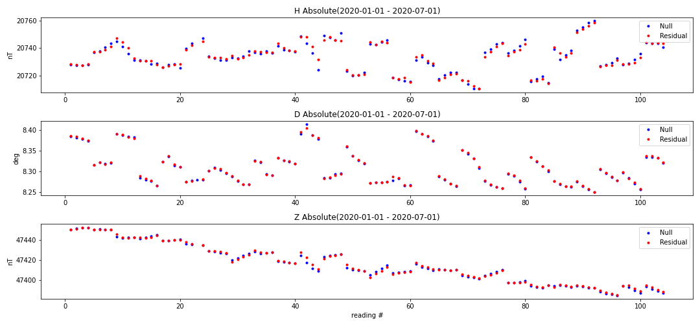
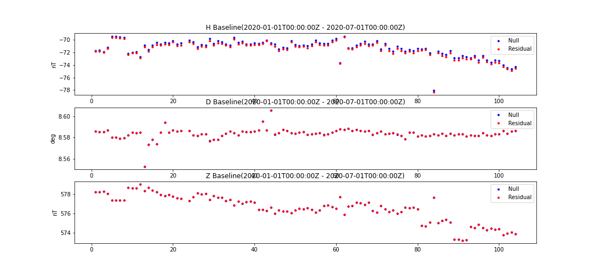

# Tools:


## Spreadsheet Absolutes Factory:
Tool for gathering a single reading from a formatted spreadsheet. Output includes measurements and absolutes. Format examples can be found in the etc/ folder.

### Usage:
```python
from geomagio.residual import SpreadsheetAbsolutesFactory

saf = SpreadsheetAbsolutesFactory()

reading = saf.parse_spreadsheet(path="../../etc/residual/DED-20140952332.xlsm")
```

## Web Absolutes Factory:
Tool for gathering several readings from webservice queries. Output can optionally include measurements, but will always return absolutes as long as they are available.

### Usage:
```python
from geomagio.residual import WebAbsolutesFactory
from obspy.core import UTCDateTime

waf = WebAbsolutesFactory()

starttime = UTCDateTime("2020-01-01")
endtime = UTCDateTime("2020-10-01")

readings = waf.get_readings(observatory="BOU", starttime=starttime, endtime=endtime, include_measurements=True)
```

## Calculation:
Implements residual method for a reading to derive new absolute values. See https://gi.copernicus.org/articles/6/419/2017/gi-6-419-2017.pdf for theoretical information.

### Usage:
```python
from geomagio.residual.Calculation import calculate
# assumes that a reading is gathered from either of the package's factories
output_reading = calculate(reading)
```

NOTE: Input readings require measurements. Current measurements are made using the null method and will not include residual values. The residual method is backwards compatible with the null method, but resulting absolute values will not be identical.

# Validation:
Backwards compatibility allows for legacy null measurements to have their absolute values recalculated by the residual method. Although absolute cannot be replicated, results can be assesed for accuracy over long time scales. The following figure serves to display the closeness this method can acheive while operating on null measurements. Data is gathered from the Boulder magnetic observatory and includes readings from a six month time span.(01/2020 - 07/2020)




